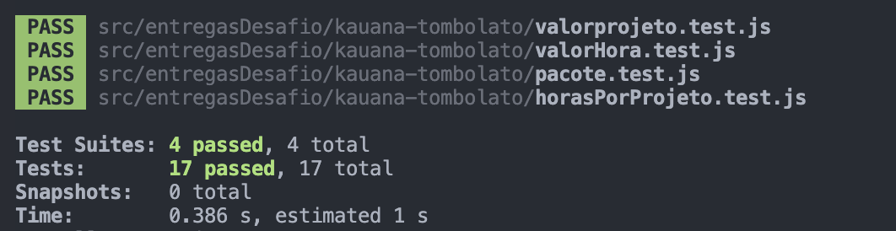
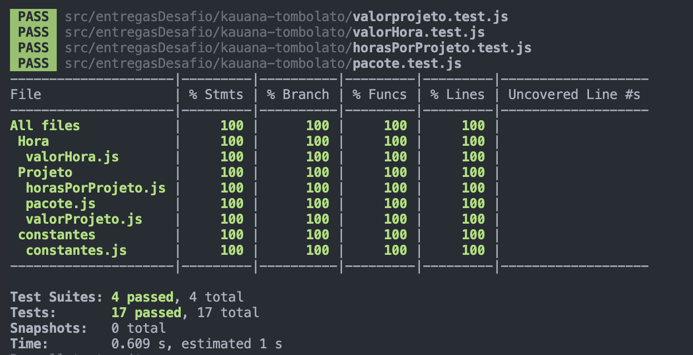

# Oficina Reprograma
# Documentação de Testes

## O que é qualidade?

### Para o cliente:
- **Bonito**: Design atraente e moderno.
- **Funcional**: Funcionalidades úteis e usabilidade intuitiva.
- **Barato**: Preço acessível e bom custo-benefício.

### Para a empresa:
- **Rápido**: Desenvolvimento ágil e eficiente.
- **Barato**: Custos controlados e economicamente viável.
- **Entrega valor ao cliente**: Produto atende ou supera as expectativas dos clientes.

### Avaliação de Qualidade:
- **Funcionalidade**: O produto faz o que foi solicitado?
- **Precisão**: O produto executa suas funções corretamente?
- **Performance**: O produto apresenta bom desempenho?
- **Segurança**: O produto é seguro?
- **Usabilidade**: O produto é fácil de usar?
- **Adaptação às necessidades**: O produto se adapta às necessidades do usuário?

## Por que testar?
- **Redução de Bugs**: Diminui o tempo gasto em análise e correção de erros.
- **Facilitação da Refatoração**: Torna mais fácil melhorar o código sem introduzir novos bugs.
- **Documentação Gerada**: Cria uma documentação útil sobre o comportamento do sistema.
- **Melhoria no Design do Código**: Testes incentivam um design de código mais limpo e modular.

## Tipos de Teste

### Principais:
- **Testes Unitários**: Validam se cada unidade de software funciona conforme o esperado. Uma unidade é o menor componente testável de um aplicativo.
- **Testes de Integração**: Validam se as unidades do sistema funcionam juntas. Incompatibilidades podem surgir mesmo após a aprovação nos testes unitários.
- **Testes de Ponta a Ponta (E2E)**: Validam o sistema de ponta a ponta, garantindo que funcione em todos os sistemas de destino pretendidos.
- **Testes de Aceitação**: Validam a aprovação do cliente, incluindo testes alfa, beta e gama.

### Outros tipos:
- **Teste de Regressão**: Verifica se novos recursos quebram funcionalidades existentes.
- **Teste de Estresse**: Testa a resistência do sistema sob carga extrema.
- **Teste de Performance/Desempenho**: Avalia o desempenho do software sob diferentes cargas de trabalho.
- **Teste Funcional**: Verifica funções emulando cenários de negócios com base em requisitos funcionais.
- **Teste de Caos**: Simula falhas para testar a resiliência do sistema.

## Teste Unitário
- **Definição**: Teste da menor parte testável de um programa, como funções em programação funcional ou métodos em orientação a objetos.
- **Objetivo**: Garantir que a aplicação continue funcionando após alterações no código.

## Implementação com Jest

### Quando usar:
- Projetos com lógica complexa.
- Funções reutilizadas em vários lugares.
- Regras de negócio cruciais para o sucesso.
- Produtos com longa vida útil.
- Projetos open-source com vários contribuidores.

### F.I.R.S.T.:
- **Rápido (Fast)**: Testes devem ser rápidos para não atrasar o desenvolvimento.
- **Isolado (Isolated)**: Testes devem ser executados isoladamente.
- **"Repetível" (Repeatable)**: Resultados consistentes em execuções repetidas.
- **"Auto-verificável" (Self-validating)**: O teste deve automaticamente verificar se passou ou falhou.
- **Minucioso (Thorough)**: Cobrir todos os cenários, incluindo casos raros.

### Boas Práticas:
- **Simples**: Testes devem ser fáceis de implementar e ler.
- **Oportuno**: A escrita de um teste não deve demorar mais que a escrita do código testado.

## Pontos Positivos
- Identificação rápida de bugs.
- Tratamento preventivo de erros.
- Mais confiança nos deploys.
- Facilita refatoração.
- Serve como documentação.

## Contrapontos
- Aumento do tempo de desenvolvimento.
- Tempo de ambientação com o projeto.
- Necessidade de reescrever testes se uma função ou módulo for refeito.

## Cobertura

- A cobertura é medida em percentual, indicando quanto do código é testado.
- Evite testar em excesso; foque em arquivos críticos e com lógica complexa.

## Como usar o Jest para Cobertura
- Configure o Jest para gerar relatórios de cobertura.
- Meça a cobertura de arquivos críticos para garantir a estabilidade do projeto.

## Pensando em como testar
- **O que o código precisa fazer?**
- **Que dados ele recebe?**
- **Que dados ele precisa retornar?**
- **Que ações precisam acontecer para o código rodar?**

## Conclusão
Testes são fundamentais para garantir a qualidade e a confiabilidade do software. Ao seguir boas práticas e utilizar ferramentas como o Jest, é possível criar um ambiente de desenvolvimento mais seguro e eficiente, que promove a entrega de valor contínuo ao cliente.

